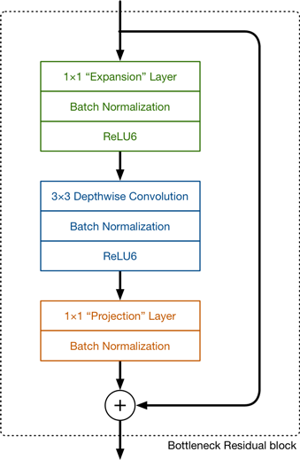
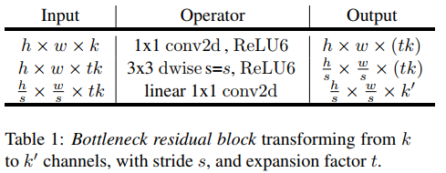

# MobilenetV2
## 深度可分离卷积
### 计算量
普通卷积
$$
    h_i\times w_i \times d_i \times d_j \times k\times k
$$    
深度可分离卷积
$$
    h_i\times w_i \times d_i\times (k^{2}+d_j)
$$

$h_i和w_i为图像的长宽,d_i和d_j分别为输入输出通道数，k为卷积核大小$
$$
    \frac{h_i\times w_i \times d_i\times (k^{2}+d_j)}{h_i\times w_i \times d_i \times d_j \times k\times k}=\frac{1}{d_j}+\frac{1}{k^{2}}
$$
当$k=3$时，深度分离卷积的计算量大约为普通卷积的$\frac{1}{9}$。
## bottleneck结构
  
即$1\times 1$卷积扩充通道，接$DW$卷积，再接$1\times 1$卷积降维。    
  
## 模型结构
  
### 参数
$t$为bottleneck的$1\times 1$卷积扩充通道倍数，$c \times \alpha$为每个bottleneck block的输出通道数，$n$为每个bottleneck block重复bottleneck结构的次数，$s$为卷积核的strides。
### bottleneck block
bottleneck block为由n个bottleneck结构组成的模块。注意只有在bottleneck block的第一个bottleneck中才会进行strides的变化，即下采样，其它的bottleneck的strides都为$1 \times 1$。     
同样的，也只有在第一个bottleneck中进行通道数的变化，所以在整个bottleneck block中的输出通道数都是一样的。    
还有需要注意的是，shortcut connection只有在第一个bottleneck中没有。     
### $\alpha$ 参数
$\alpha$ 参数为宽度参数，即控制模型的通道数。模型每一个block的输出通道数为$c \times \alpha$。   
需要注意的是，对于小于1的$\alpha$，最后一个卷积层不应用该参数，固定为1280。
### 

